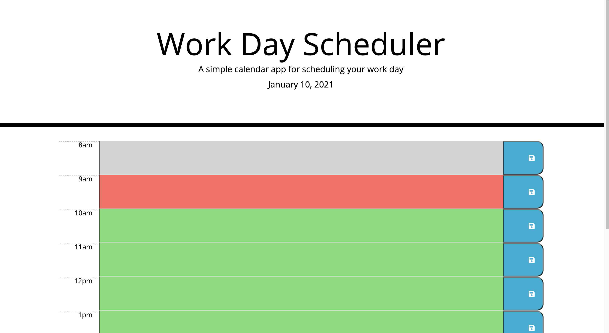

# day-scheduler

## Purpose
A website that allows employees with a busy schedule to add important events to a daily planner. This allows employees to manage their time effectively. 

## Built With
* HTML
* CSS
* Bootstrap
* JQuery
* Moment.js

## Website
https://pmac16.github.io/day-scheduler/

## Description
When opening the planner, the current day is displayed at top for the user. 

When the user scrolls down, they are presented with time blocks for the standard business hours. Each of these time blocks is color-coded to show if it is in the past, present, or future. 

When the user clicks into a time block, they are able to enter an event. After clicking the save button, the event is saved into local storage. The user can also edit the event and save.

### ©️Priya Macpherson